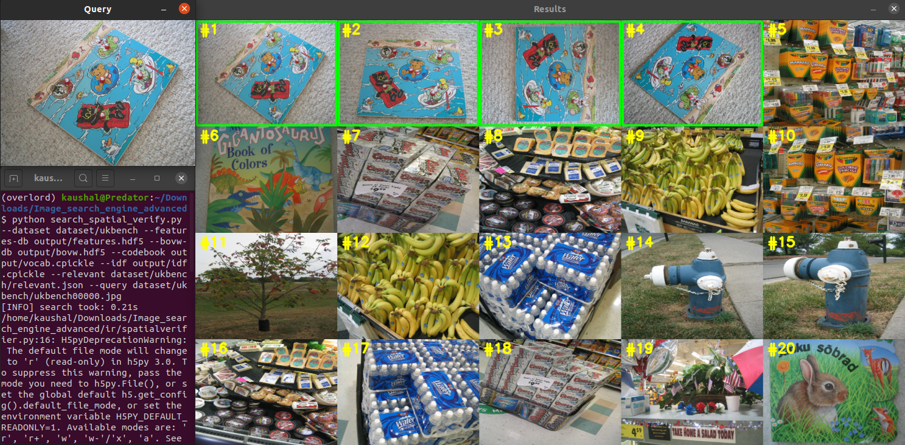
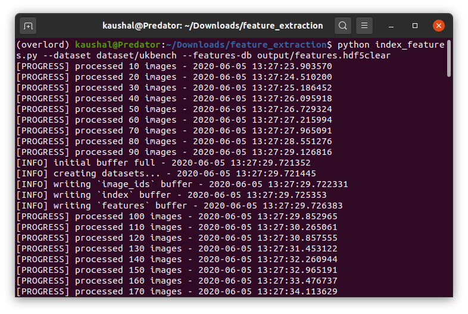
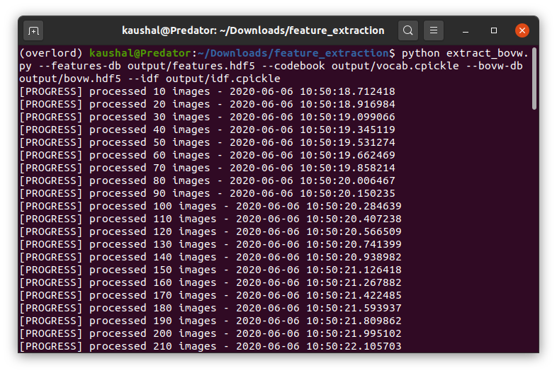
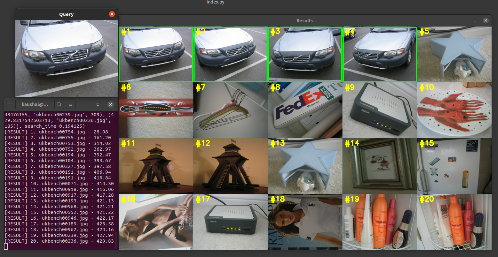
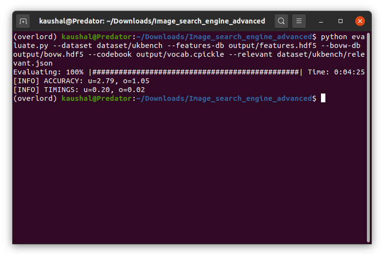
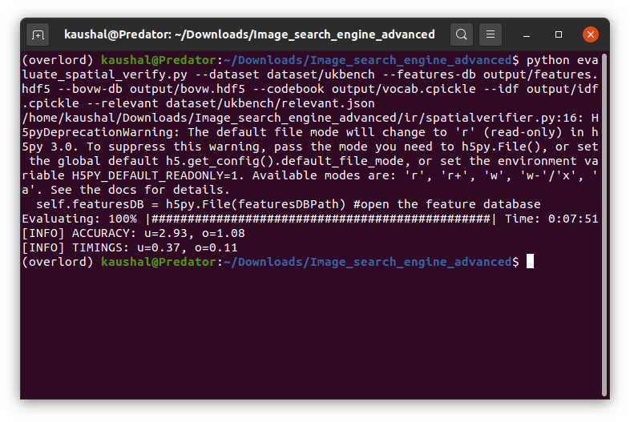

# Image Search Engine (CBIR)

Bringing you a production level quality of code for a **Content Based Image Retrival system**, commanly known as, Image Search Engine.
The project is based solely on Computer Vision and little bit of machine learning to form clusters. 

**The project does not follow a Deep Learning Approach**.
I'll be using **"Bag of Visual Words"** model to build a highly scalable and accurate CBIR system



## Features of the project:
1. Production level code.
2. Highly Scalable as we are using [HDF5](https://www.hdfgroup.org/) and [Redis](https://redis.io/) to manage, store and retrive the database.
3. Keypoints and Local invarient descriptors are used to make is robust and accurate.
4. OpenCV 4
5. Buffering before writing features to disk.
6. Evaluation at intermediate steps to compare feature impacts

## Steps followed by the code
1. Extracting keypoints and local invariant descriptors
2. Creation of a codebook by clustering features
3. Vector quantization
4. Building an inverted indexing of the features on Redis
5. Tf-idf weighting
6. Addition of Spatial Verification on top results to rerank the results; increasing accuracy.
7. Evaluation (done after adding new techniques to compare the accuracies before and after the addition to measure the impact)

## The Data:
The data used in the project is the famous [ukbench dataset](http://riemenschneider.hayko.at/vision/dataset/task.php?did=44).
I have included the dataset in the project folder itself. After cloning the repo to local machine, **unzip the dataset.zip file** before runing the code.
There is a file inside the dataset/ukbench folder called relevant.json which contains the image and it's matching or relevant images which will be used to test the model and compare techniques we'll be using in the project

### Requirements:

To install the dependencies, run this below command in the root folder of the project
```
pip install -r requirements.txt
```

Installing Redis:
```
$ mkdir ~/services
$ cd ~/services
$ wget http://download.redis.io/redis-stable.tar.gz
$ tar xvzf redis-stable.tar.gz
$ cd redis-stable
$ make
$ sudo make install
```


**TIP**: I have used OpenCV 4.0.0. To install OpenCV 4, follow this [amazing guide](https://www.pyimagesearch.com/2018/08/15/how-to-install-opencv-4-on-ubuntu/)
and **remember to turn "ON" opencv_enable_flag during installation to use keypoint and local invarient descriptor we used in this code.** The tutorial I mentioned have included the instructions to do that, look out for that instructions.

## Running the code on ukbench dataset:

To run the final search and see the end result of pretrained and on pre-extracted features:
```
$ python search_spatial_verify.py --dataset dataset/ukbench --features-db output/features.hdf5 \
	--bovw-db output/bovw.hdf5 --codebook output/vocab.cpickle --idf output/idf.cpickle \
	--relevant dataset/ukbench/relevant.json --query dataset/ukbench/ukbench00436.jpg
```
## Runing the code to train on your own dataset:
Put your data inside the dataset folder and include a relevant.json file for testing (optional) just like the one in dataset/ukbench folder. Replace ukbench folder name with your new image folder name.
### 1. Extract features:

```
$ python index_features.py --dataset dataset/ukbench --features-db output/features.hdf5
```

This will create feature.hdf5 file in your output folder.


### 2. Creation of a codebook by clustering features
```
python cluster_features.py --features-db output/features.hdf5 --codebook output/vocab.cpickle --clusters 1536 --percentage 0.25
```

This will create a vocab.cpickle file in output folder. This will be the vocabulary for image's features.

OPTIONAL STEP: If you want to visualize the vocabulary of words you have created. Run this:
```
$ mkdir output/vw_vis
$ python visualize_centers.py --dataset dataset/ukbench --features-db output/features.hdf5 --codebook output/vocab.cpickle --output output/vw_vis
```

### 3. Vector quantization:

```
$ python extract_bovw.py --features-db output/features.hdf5 --codebook output/vocab.cpickle --bovw-db output/bovw.hdf5 --idf output/idf.cpickle
```
This will create a file idf.cpickle which will contain inverted document frequencies for the visual words.



### 4. Building an inverted indexing of the features on Redis
Start Redis server
```
$ ./redis-server
```
From there, build the inverted index by issuing the following command:
```
### $ python build_redis_index.py --bovw-db output/bovw.hdf5
```
##### (Optional) Perforn an intermediate search on the images
```
$ python search.py --dataset dataset/ukbench --features-db output/features.hdf5 --bovw-db output/bovw.hdf5 --codebook output/vocab.cpickle --relevant dataset/ukbench/relevant.json --query dataset/ukbench/ukbench00258.jpg
```


##### (Optional) Evaluate to compare before adding more features to the code.
```
$ python evaluate.py --dataset dataset/ukbench --features-db output/features.hdf5 --bovw-db output/bovw.hdf5 --codebook output/vocab.cpickle --relevant dataset/ukbench/relevant.json
```


### 5. Tf-idf weighting:
Searching using tf-idf vectors and the cosine distance (versus the raw BOVW histogram counts and the chi-sqaured) is as simple as supplying the --idf switch to our search.py script

### 6. Spatial Verification on top results to rerank the results; increasing accuracy:
```
$ python search_spatial_verify.py --dataset dataset/ukbench --features-db output/features.hdf5 --bovw-db output/bovw.hdf5 --codebook output/vocab.cpickle --idf output/idf.cpickle \
	--relevant dataset/ukbench/relevant.json --query dataset/ukbench/ukbench00000.jpg
```

### 7. Final Evaluation:
```
$ python evaluate_spatial_verify.py --dataset dataset/ukbench --features-db output/features.hdf5 --bovw-db output/bovw.hdf5 --codebook output/vocab.cpickle --idf output/idf.cpickle --relevant dataset/ukbench/relevant.json
```


## Author: Kaushal Bhavsar

### Tips:
1. Use Virtual environment if you have other version of python or OpenCV
2. Remember to install keypoint and local invarient features while install OpenCV. They have to be flagged "ON" while installing opencv as they are copyrighted and can be only used of research or learning purposes
3. If training on your own dataset, read the comments in the code to understand the process.
4. Visualization and initial feature extraction will take a considerable amount of time.
